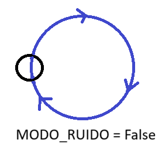
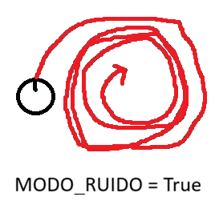

  
**Integrantes:** 

* Alonso Maurel  
* Monserrath Morales   
* Pablo Daza  
* Miguel Bernales  
* Nehemías Leiva

**Repositorio:** [https://github.com/ZZZZIK/Lab-1-robotica](https://github.com/ZZZZIK/Lab-1-robotica) 

**Laboratorio 1:** Simulación de un Robot Móvil Diferencial en Webots Objetivo Comprender el comportamiento cinemático de un robot móvil diferencial mediante una simulación interactiva en Webots, donde los actuadores (motores de las ruedas) controlan el movimiento del robot.

**Introducción:**  
Un robot movil diferencial utiliza dos ruedas motrices independientes ubicadas a cada lado del robot. El movimiento depende de las velocidades de cada rueda. En este laboratorio se utilizara Webots para simular el robot y observar como las velocidades de las ruedas determinan su movimiento.

**Instrucciones para ejecutar la simulacion en Webots:**

Pasos previos a la ejecucion: Instalar Python(version 3.10 o superior) y Webots.

Paso 1: Descargar los archivos del repositorio de Github 
Paso 2: Ejecutar Webots
Paso 3: Dar click en File y abrir la carpeta "Lab1" seguir la ruta Lab1-\>worlds-\>laboratorio\_1.wbt 
Paso 4: Una vez cargado el archivo, darle click al icono de la carpeta que se encuentra sobre la terminal de la derecha (open existing text file) y seguir la ruta lab1-\>controllers-\>control\_motores\_ruedas-\>control\_motores\_ruedas.py 
Paso 5: Cambiar el valor de "MODO\_RUIDO \=" a True o False segun quiera observar el comportamiento. 
Paso 6: Iniciar la simulacion usando los controles de pausa, resumen, rebobinar, etc.

Resultados obtenidos: \-Se pudo observar un notorio cambio en la trayectoria del Robot al modificar el valor de Ruido para cada rueda, pues provoco movimientos erraticos sin seguir la trayectoria predefinida. \-Al modificar la velocidad de las ruedas de manera que sean desiguales, el robot va a girar hacia el lado de la rueda con velocidad mas baja. \-Si omitimos el ruido y dejamos las ruedas con igual velocidad, el robot se mueve en linea recta. \-Si las velocidades de ambas ruedas son un numero y su inverso aditivo respectivamente, el robot va a girar sobre su propio eje.

**Trayectoria del robot observada sin ruido:**    

**Trayectoria del robot observada con ruido:**  

*(Los videos del comportamiento del robot y su trayectoria se encuentran en el repositorio, carpeta “Videos”)*

Se puede observar en la captura de pantalla que el robot sin ruido realiza la siguiente trayectoria, tanto en la parte inicial donde comienza de manera recta, luego cuando se la da la instrucción de ir en curva, luego en forma de círculo y finalmente en su propio eje. Esta configuración cumple fluidamente los cuatro estados programados.

En cambio cuando se le agrega ruido, el robot vibra y se comporta de manera errática o impredecible debido a que el código suma valores aleatorios. Esta configuración es una fiel representación de factores externos reales como el derrape de las ruedas o el suelo irregular.

**Preguntas de análisis:**

1\. ¿Qué ocurre cuando ambas ruedas tienen la misma velocidad?  
A una misma velocidad, el robot se deberá mover en línea recta. Si se modifica el ruido en True o False, la trayectoria puede ser perfectamente recta (misma distancia por segundo) o se desvíe constantemente.  

2\. ¿Cómo cambia la trayectoria cuando las velocidades son diferentes?  
Al cambiar la velocidad de la rueda a un valor mayor o menor, el robot tendrá una trayectoria curvilínea, la rueda con menor velocidad hará que el robot gire sobre esta dirección. Si se activa el ruido, el radio de la curva cambiará cada milisegundo.  

3\. ¿Qué ocurre cuando una rueda gira en sentido opuesto a la otra?   
Al cambiar el sentido de la misma velocidad en ambas ruedas, el robot girará sobre sí mismo.  
 
 

4\. ¿Qué tipo de movimiento permite dibujar un círculo?  
Un movimiento de radio constante (sin que ninguna rueda esté estática), manteniendo una diferencia de velocidad constante entre las dos ruedas.  
 
 
